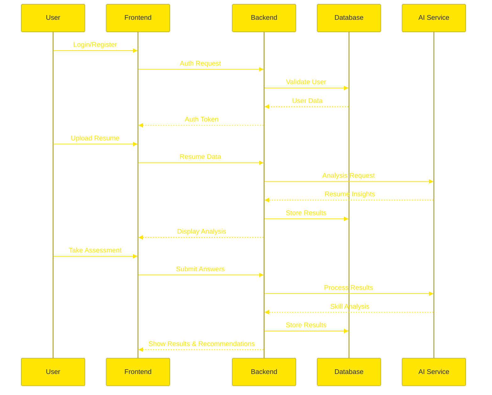

# SkillBridge Platform

A modern skill assessment and learning platform with AI-powered insights.

## System Architecture

```mermaid
%%{
  init: {
    'theme': 'base',
    'themeVariables': {
      'backgroundColor': '#2e2e38',
      'primaryColor': '#ffe600',
      'primaryTextColor': '#2e2e38',
      'secondaryColor': '#ffe600',
      'tertiaryColor': '#ffe600',
      'textColor': '#ffe600'
    }
  }
}%%
graph TB
    subgraph Frontend ["Frontend (HTML/CSS/JS)"]
        UI[User Interface] --> Components[Components]
        Components --> Pages[Pages]
        Components --> SharedUI[Shared UI Elements]
    end

    subgraph Backend ["Backend (FastAPI)"]
        API[API Layer] --> Services[Services]
        Services --> Models[Data Models]
        Services --> AI[AI Services]
    end

    subgraph Database ["Database Layer"]
        PG[(PostgreSQL)]
    end

    subgraph External ["External Services"]
        OpenAI[OpenAI GPT-4]
    end

    UI --> API
    Services --> PG
    AI --> OpenAI

    style Frontend fill:#2e2e38,stroke:#ffe600
    style Backend fill:#2e2e38,stroke:#ffe600
    style Database fill:#2e2e38,stroke:#ffe600
    style External fill:#2e2e38,stroke:#ffe600
```



## Data Flow



## Wireframes

```mermaid
%%{
  init: {
    'theme': 'base',
    'themeVariables': {
      'backgroundColor': '#2e2e38',
      'primaryColor': '#ffe600',
      'primaryTextColor': '#2e2e38',
      'secondaryColor': '#ffe600',
      'tertiaryColor': '#ffe600',
      'textColor': '#ffe600'
    }
  }
}%%
graph TB
    subgraph Home ["Home Page"]
        Nav[Navigation Bar]
        Hero[Hero Section]
        Features[Features Grid]
    end

    subgraph Dashboard ["Dashboard"]
        Welcome[Welcome Section]
        Progress[Progress Charts]
        Recent[Recent Activities]
        Recommend[Recommendations]
    end

    subgraph Assessment ["Assessment Flow"]
        Start[Start Page]
        Resume[Resume Upload]
        Quiz[Quiz Interface]
        Results[Results Page]
    end

    Home --> Dashboard
    Dashboard --> Assessment

    style Home fill:#2e2e38,stroke:#ffe600
    style Dashboard fill:#2e2e38,stroke:#ffe600
    style Assessment fill:#2e2e38,stroke:#ffe600
```



## Features

### Frontend
- Modern, responsive UI
- Interactive assessments
- Real-time progress tracking
- AI-powered insights visualization
- Personalized dashboard

### Backend
- FastAPI REST endpoints
- JWT authentication
- PostgreSQL database
- OpenAI integration
- Resume analysis engine

### Assessment System
- Multiple domain support
- Adaptive questioning
- Instant feedback
- Progress tracking
- Skill gap analysis

## Setup Instructions

1. Clone the repository
```bash
git clone https://github.com/yourusername/skillbridge.git
cd skillbridge
```

2. Install frontend dependencies
```bash
cd frontend
npm install
```

3. Install backend dependencies
```bash
cd backend
pip install -r requirements.txt
```

4. Configure environment variables
```bash
cp .env.example .env
# Edit .env with your configurations
```

5. Start the development servers
```bash
# Frontend
npm run dev

# Backend
uvicorn app.main:app --reload
```

## Tech Stack

### Frontend
- HTML5/CSS3
- JavaScript
- Bootstrap 5
- Chart.js
- Font Awesome

### Backend
- Python 3.9+
- FastAPI
- SQLAlchemy
- OpenAI GPT-4
- PostgreSQL

## Contributing

1. Fork the repository
2. Create your feature branch (`git checkout -b feature/AmazingFeature`)
3. Commit your changes (`git commit -m 'Add some AmazingFeature'`)
4. Push to the branch (`git push origin feature/AmazingFeature`)
5. Open a Pull Request

## License

This project is licensed under the MIT License - see the [LICENSE](LICENSE) file for details.

## Acknowledgments

- OpenAI for GPT-4 API
- Bootstrap team for the UI framework
- FastAPI team for the backend framework
